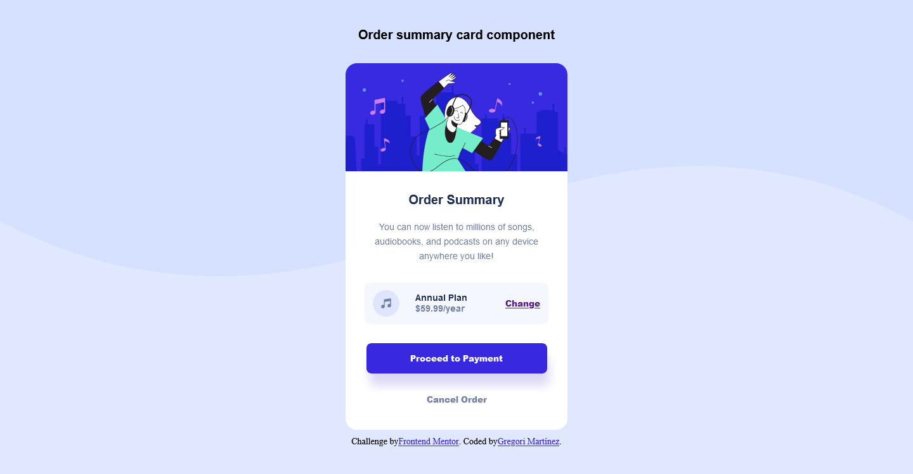

# Frontend Mentor - Order summary card solution

This is a solution to the [Order summary card challenge on Frontend Mentor](https://www.frontendmentor.io/challenges/order-summary-component-QlPmajDUj). Frontend Mentor challenges help you improve your coding skills by building realistic projects. 

## Table of contents

- [Overview](#overview)
  - [The challenge](#the-challenge)
  - [Screenshot](#screenshot)
  - [Links](#links)
- [My process](#my-process)
  - [Built with](#built-with)
  - [What I learned](#what-i-learned)
  - [Continued development](#continued-development)
- [Author](#author)

## Overview

### The challenge

Users should be able to:

- See hover states for interactive elements

### Screenshot

Here's a screenshot of the result I got.

### Links

- Repository URL: [Click here](https://github.com/GregoriM04/order-summary-component.git)
- Live Site URL: [Click here](https://your-live-site-url.com)

## My process

### Built with

- Semantic HTML5 markup
- CSS custom properties
- Flexbox
- Mobile-first workflow

### What I learned

I think I am just getting more comfy with the results I have been achiving so far; so, I just kept practicing positioning elements inside the document and feeling so proud of the outcome I have had.

### Continued development

I need to continue working on making easy things even easier code; I know that every challenge has its own complexity and my code is more or less readable, but I want more and better skills. I think I just need to continue practing more and more. Practice makes perfect.

## Author

- LinkedIn - [Gregori Martinez](https://www.linkedin.com/in/gregorim04/)
- Frontend Mentor - [@GregoriM04](https://www.frontendmentor.io/profile/GregoriM04)
- Twitter - [@GregoriM04](https://twitter.com/GregoriM04)